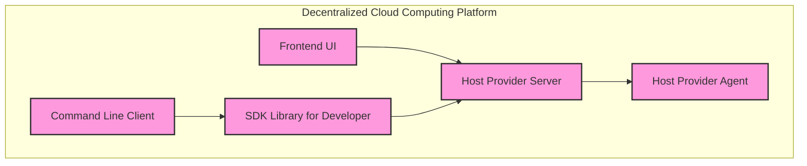

This diagram shows the high-level structure of your system and how its various components interact with each other. The Frontend UI and Command Line Client both interact with the Host Provider Server to query and reserve cloud resources. The SDK Library for Developer provides programmatic access to the cloud and can be used by the Command Line Client or integrated into other tools. The Host Provider Server communicates with the Host Provider Agent via a message bus to provision compute resources.
