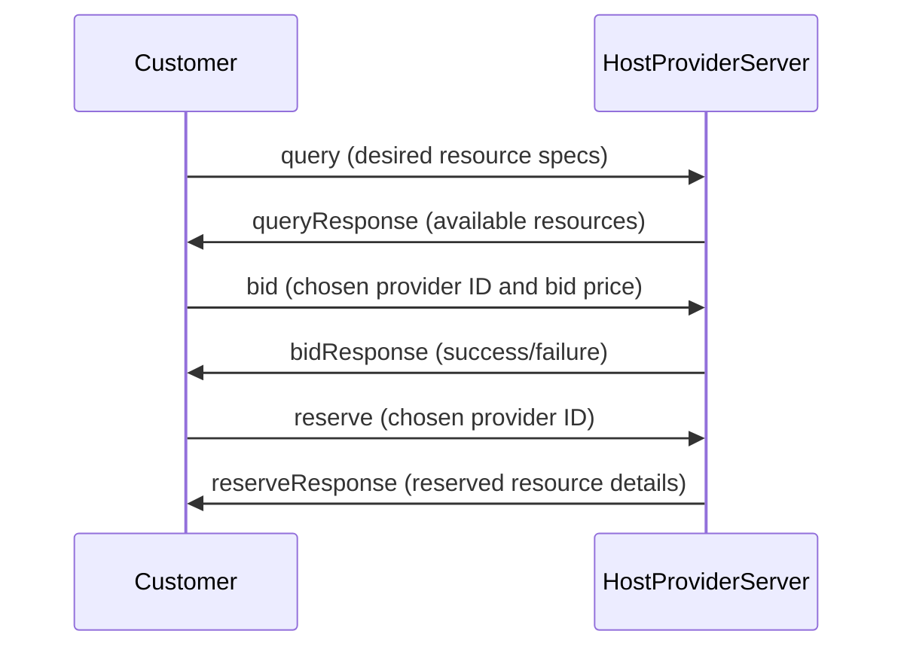

Here's a draft design proposal for the protocol and message flow for a customer querying, bidding, and reserving compute resources on your decentralized cloud computing platform:


1. The customer sends a `query` message to the Host Provider Server containing their desired compute resource specifications (e.g., CPU, RAM, storage) in JSON format.

```json
{
    "type": "query",
    "data": {
        "cpu": 4,
        "ram": 8,
        "storage": 100
    }
}
```

2. The Host Provider Server processes the query and returns a list of available compute resources from different host providers that match the customer's specifications.

```json
{
    "type": "queryResponse",
    "data": [
        {
            "providerId": 1,
            "cpu": 4,
            "ram": 8,
            "storage": 100,
            "pricePerHour": 0.10
        },
        {
            "providerId": 2,
            "cpu": 4,
            "ram": 8,
            "storage": 120,
            "pricePerHour": 0.12
        }
    ]
}
```

3. The customer reviews the available options and selects one by sending a `bid` message to the Host Provider Server containing their chosen provider ID and bid price.

```json
{
    "type": "bid",
    "data": {
        "providerId": 1,
        "bidPrice": 0.11
    }
}
```

4. The Host Provider Server processes the bid and returns a `bidResponse` message indicating whether the bid was successful or not.

```json
{
    "type": "bidResponse",
    "data": {
        "status": "success"
    }
}
```

5. If the bid was successful, the customer can then send a `reserve` message to confirm their reservation of the compute resources.

```json
{
    "type": "reserve",
    "data": {
        "providerId": 1
    }
}
```

6. The Host Provider Server processes the reservation and returns a `reserveResponse` message containing details of the reserved compute resources.

```json
{
    "type": "reserveResponse",
    "data": {
        "providerId": 1,
        <IPAddress>4</IPAddress>,
        <IPAddress>22</IPAddress>,
        <IPAddress>ssh</IPAddress>
    }
}
```

Here's an example of a sequence diagram showing this message flow using mermaid:



This is just one possible approach to designing the protocol for querying, bidding, and reserving compute resources on your decentralized cloud computing platform. You may want to consider additional factors such as security, scalability, and fault tolerance when finalizing your design.

Would you like more information on any specific aspect?