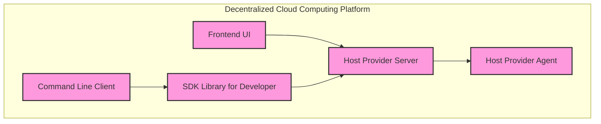

Here's an example of a component diagram for your system using the mermaid diagram language:

This diagram shows the high-level structure of your system and how its various components interact with each other. The Frontend UI and Command Line Client both interact with the Host Provider Server to query and reserve cloud resources. The SDK Library for Developer provides programmatic access to the cloud and can be used by the Command Line Client or integrated into other tools. The Host Provider Server communicates with the Host Provider Agent via a message bus to provision compute resources.

As for protocols used in similar systems, there are many different approaches that can be taken. Some systems use blockchain technology to create a decentralized ledger of transactions and resource usage. Others use distributed hash tables (DHTs) to store and retrieve data in a decentralized manner. It might be helpful to research existing decentralized cloud computing platforms to see what approaches they have taken.

Would you like more information on any specific aspect?